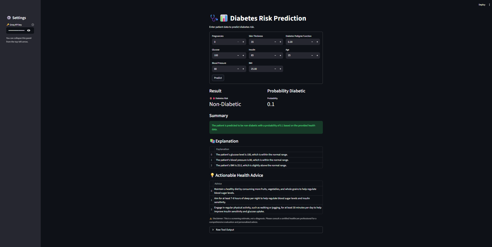

# Diabetes Risk Prediction Agent

This project implements an AI agent using CrewAI to predict diabetes risk based on patient health data. The system combines machine learning with LLM-powered agents to provide accurate risk assessments and personalized recommendations.

## 📋 Table of Contents
- [Project Overview](#project-overview)
- [Dataset](#dataset)
- [Features](#features)
- [Installation](#installation)
- [Usage](#usage)
- [Demo](#demo)
- [Project Structure](#project-structure)
- [Technologies Used](#technologies-used)
- [License](#license)

## 🎯 Project Overview

The Diabetes Risk Prediction Agent is an intelligent system that analyzes patient health data to predict the likelihood of diabetes. It uses a trained machine learning model to make predictions and an AI agent to interpret results and provide personalized health recommendations.

Key components:
- Machine learning model trained on the Pima Indians Diabetes Database
- CrewAI agent that processes predictions and generates human-readable reports
- Streamlit web interface for easy interaction
- Data preprocessing and model training pipeline

## 📊 Dataset

The model is trained on the dataset, which contains health data for women aged 21 and above. The dataset includes the following features:

| Feature | Description |
|---------|-------------|
| Pregnancies | Number of times pregnant |
| Glucose | Plasma glucose concentration |
| BloodPressure | Diastolic blood pressure (mm Hg) |
| SkinThickness | Triceps skin fold thickness (mm) |
| Insulin | 2-Hour serum insulin (mu U/ml) |
| BMI | Body mass index (weight in kg/(height in m)^2) |
| DiabetesPedigreeFunction | Diabetes pedigree function |
| Age | Age in years |
| Outcome | Class variable (0 or 1) |

## ✨ Features

- **Accurate Predictions**: Uses a trained Random Forest classifier for diabetes risk assessment
- **AI-Powered Interpretation**: CrewAI agent interprets results and provides personalized recommendations
- **User-Friendly Interface**: Streamlit web app for easy data input and result visualization
- **Comprehensive Analysis**: Provides risk probability, influencing factors, and lifestyle recommendations
- **Medical Disclaimer**: Includes appropriate disclaimers about the nature of predictions

## 🚀 Installation

1. Clone the repository:
   ```bash
   git clone <repository-url>
   cd 6.ML_Agent
   ```

2. Create a virtual environment (Python 3.8+ recommended):
   ```bash
   python -m venv venv
   source venv/bin/activate  # On Windows: venv\Scripts\activate
   ```

3. Install dependencies:
   ```bash
   pip install -r requirement.txt
   ```

4. Set up the model:
   Ensure the trained model is located at `artifacts/model/model.pkl`

## 📖 Usage

1. Obtain a Groq API key from [Groq Cloud](https://console.groq.com/)

2. Run the Streamlit application:
   ```bash
   streamlit run streamlit_src/app.py
   ```

3. Enter patient data in the web interface:
   - Provide all required health metrics (example values: Pregnancies: 2, Glucose: 120, Blood Pressure: 70, etc.)
   - Enter your Groq API key
   - Click "Predict" to get the risk assessment

## ▶️ Demo

<video src="assets/demo.mp4" width="100%" controls></video>

*Demo video showing the application in action*

*Note: If the video is not rendering, you can view it directly by downloading the `demo.mp4` file from the `assets` folder.*

### Model Output:


### App Interface



## 📁 Project Structure

```
6.ML_Agent/
├── agent_src/              # CrewAI agent implementation
│   ├── __init__.py
│   ├── agents.py           # Agent definitions
│   ├── crew.py             # Crew orchestration
│   ├── tasks.py            # Task definitions
│   └── tools.py            # Custom tools for prediction
├── artifacts/              # Data and model files
│   ├── dataset/
│   │   └── diabetes.csv    # Original dataset
│   └── model/
│       └── model.pkl       # Trained ML model
├── assets/                 # Demo assets and outputs
│   ├── demo.mp4            # Demo video (download to view)
│   ├── model_output.png    # Model performance visualization
│   └── output.png          # Sample output
├── ml_src/                 # Machine learning source code
│   └── train_model.py      # Model training script
├── streamlit_src/          # Streamlit application
│   ├── __init__.py
│   ├── app.py              # Main application
│   └── old_app.py          # Previous version
├── data_preprocessing.ipynb # Data analysis and preprocessing along with ML algorithm metrics 
├── README.md               # This file
└── requirement.txt         # Python dependencies
```

## 🛠️ Technologies Used

- **Python** - Core programming language
- **CrewAI** - Multi-agent framework for AI orchestration
- **Scikit-learn** - Machine learning library
- **Streamlit** - Web application framework
- **Pandas/Numpy** - Data manipulation and analysis
- **Joblib** - Model serialization
- **Groq API** - LLM inference

## 📄 License

This project is licensed under the MIT License - see the LICENSE file for details.

## 🙏 Acknowledgments
- [CrewAI](https://www.crewai.com/) for the multi-agent framework
- [Groq](https://groq.com/) for fast LLM inference