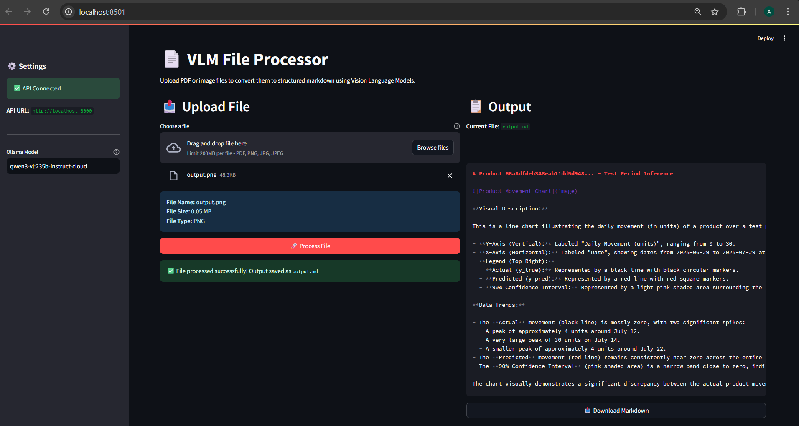

# VLM File Processor

A powerful document processing application that converts PDF and image files to structured markdown using Vision Language Models (VLM). Built with FastAPI for the backend and Streamlit for the frontend.


## 🌟 Features

- **Multi-format Support**: Process PDF, PNG, JPG, and JPEG files
- **Vision Language Models**: Leverages Ollama's VLM for intelligent document parsing
- **RESTful API**: FastAPI backend for programmatic access
- **Interactive UI**: Streamlit frontend for easy file processing
- **Structured Output**: Converts documents to clean, semantic markdown
- **Smart Parsing**: Handles tables, formulas, images, and complex layouts
- **File Management**: View, download, and delete processed files
- **Automatic Cleanup**: Removes old files after 10 minutes

## �️ User Interface



The Streamlit interface provides an intuitive way to upload, process, and manage your documents with real-time preview and download capabilities.

## �📋 Table of Contents

- [Installation](#installation)
- [Quick Start](#quick-start)
- [Usage](#usage)
- [API Documentation](#api-documentation)
- [Configuration](#configuration)
- [Project Structure](#project-structure)

## 🚀 Installation

### Prerequisites

- Python 3.12 or higher
- Ollama installed and running
- Git (optional, for cloning)

### Step 1: Clone or Download the Project

```bash
git clone <repository-url>
cd VLM_project
```

### Step 2: Create Virtual Environment

```bash
python -m venv vlm_env
```

### Step 3: Activate Virtual Environment

**Windows:**
```bash
vlm_env\Scripts\activate
```

**Linux/Mac:**
```bash
source vlm_env/bin/activate
```

### Step 4: Install Dependencies

```bash
pip install -r requirements.txt
```

### Step 5: Configure Environment Variables

Create a `.env` file in the project root:

```env
OLLAMA_BASE_URL=https://ollama.com
OLLAMA_API_KEY=<API_KEY>
DEFAULT_MODEL=qwen3-vl:235b-instruct-cloud
```

## ⚡ Quick Start

**Terminal 1 - Start FastAPI Backend:**
```bash
vlm_env\Scripts\activate
uvicorn app.main:app --reload --port 2007
```

**Terminal 2 - Start Streamlit Frontend:**
```bash
vlm_env\Scripts\activate
streamlit run app/streamlit_app.py
```

### Access Points

- **Streamlit App**: http://localhost:8501
- **FastAPI Docs**: http://localhost:2007/docs
- **API Root**: http://localhost:2007

## 📖 Usage

### Using the Streamlit Interface

1. **Open the App**: streamlit run app/streamlit_app.py
2. **Upload a File**: Click "Browse files" or drag and drop a PDF/image. (File size limitation is 50 MB)
3. **Configure Settings**: Default model is used. (qwen3-vl:235b-instruct-cloud)
4. **Process**: Click "🚀 Process File"
5. **View Output**: See the generated markdown in the right panel
6. **Download**: Click "📥 Download Markdown" to save the file
7. **Manage Files**: View and delete previous outputs at the bottom

### Using the API

#### Parse a File

```bash
curl -X POST "http://localhost:2007/api/parse-file" \
  -F "file=@document.pdf" \
  -F "model=qwen3-vl:235b-instruct-cloud"
```

#### List Output Files

```bash
curl http://localhost:2007/api/output
```

#### Get a Specific File

```bash
curl http://localhost:2007/api/output/document.md -o output.md
```

#### Delete a File

```bash
curl -X DELETE http://localhost:2007/api/output/document.md
```

### Python API Client Example

```python
import requests

API_BASE_URL = "http://localhost:2007"

# Upload and parse a file
with open("document.pdf", "rb") as f:
    response = requests.post(
        f"{API_BASE_URL}/api/parse-file",
        files={"file": f},
        data={"model": "qwen3-vl:235b-instruct-cloud"}
    )
    result = response.json()
    print(f"Output saved to: {result['output_path']}")

# List all output files
response = requests.get(f"{API_BASE_URL}/api/output")
files = response.json()["files"]
print(f"Available files: {files}")

# Download a specific file
response = requests.get(f"{API_BASE_URL}/api/output/document.md")
with open("downloaded.md", "wb") as f:
    f.write(response.content)
```

## 📚 API Documentation

### Endpoints

#### `GET /api/`
Health check endpoint.

**Response:**
```json
{
  "message": "Welcome to VLM File Processor API"
}
```

#### `GET /api/formats`
Get list of supported file formats.

**Response:**
```json
{
  "formats": ["pdf", "png", "jpg", "jpeg"]
}
```

#### `POST /api/parse-file`
Upload and process a file.

**Parameters:**
- `file` (UploadFile, required): The file to process
- `model` (str, optional): Ollama model name (default: from env)
- `output_dir` (str, optional): Output directory (default: "app/outputs")

**Response:**
```json
{
  "status": "success",
  "output_path": "app/outputs/document.md",
  "filename": "document.md"
}
```

**Error Responses:**
- `400`: File size exceeds limit or unsupported format
- `404`: File not found
- `503`: Ollama service unavailable
- `500`: Internal server error

#### `GET /api/output`
List all generated markdown files.

**Response:**
```json
{
  "files": ["document1.md", "document2.md"],
  "count": 2
}
```

#### `GET /api/output/{filename}`
Download a specific markdown file.

**Response:** File content as markdown

#### `DELETE /api/output/{filename}`
Delete a specific markdown file.

**Response:**
```json
{
  "message": "File deleted successfully"
}
```

## ⚙️ Configuration

### Environment Variables

| Variable | Description | Default |
|----------|-------------|---------|
| `DEFAULT_MODEL` | Ollama model name | `qwen3-vl:235b-instruct-cloud` |
| `OLLAMA_BASE_URL` | Ollama service URL | `https://ollama.com` |
| `OLLAMA_API_KEY` | Ollama API key (required) | None |
| `API_BASE_URL` | FastAPI base URL | `http://localhost:2007` |
| `ALLOWED_ORIGINS` | CORS allowed origins | `*` |

### Supported File Formats

- **PDF**: `.pdf`
- **Images**: `.png`, `.jpg`, `.jpeg`

### File Size Limit

Maximum file size: **50 MB**

### Output Format

The application converts documents to structured markdown with:

- ✅ Semantic headers and hierarchy
- ✅ Proper list formatting (bullets and numbered)
- ✅ Table preservation (markdown or HTML for complex tables)
- ✅ Mathematical formulas (LaTeX syntax: `$inline$` and `$$display$$`)
- ✅ Image descriptions with detailed visual analysis
- ✅ Code blocks with language specification
- ✅ Links and citations
- ✅ Blockquotes and callouts
- ✅ Footnotes

## 📁 Project Structure

```
VLM_project/
├── app/
│   ├── main.py                 # FastAPI application entry point
│   ├── streamlit_app.py        # Streamlit frontend application
│   ├── endpoints/
│   │   ├── __init__.py
│   │   └── routes.py           # API route definitions
│   ├── services/
│   │   ├── __init__.py
│   │   └── parser.py           # File parsing logic
│   └── outputs/                # Generated markdown files
├── data/                       # Data directory (if needed)
├── asserts/                    # UI image
├── sample_outputs/             # Sample output files
├── vlm_env/                    # Python virtual environment
├── requirements.txt            # Python dependencies
├── .env                        # Environment variables (create this)
├── .gitignore                  # Git ignore rules
├── Dockerfile                  # Docker configuration
├── docker-compose.yml          # Docker Compose configuration
├── README.md                   
```
