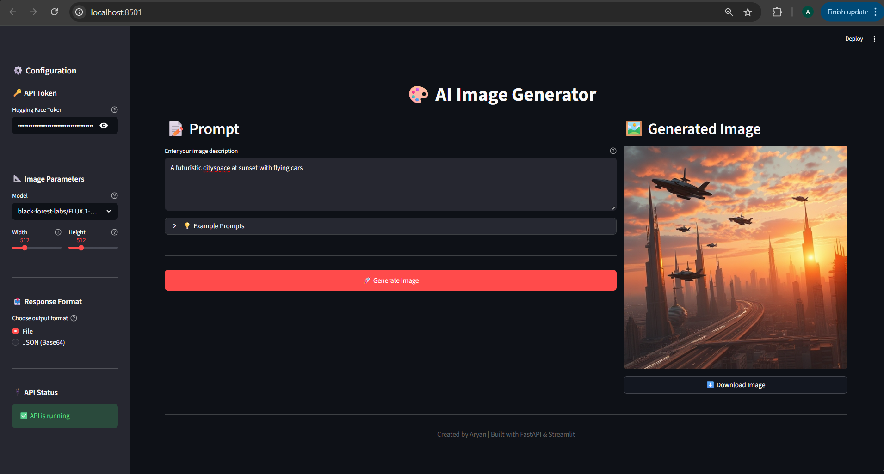

# Image Generation API

A FastAPI-based REST API for generating images using Hugging Face's Inference API, with a beautiful Streamlit frontend.

## Features

- 🎨 Generate images from text prompts
- 📊 Multiple output formats (file download or base64 JSON)
- 🔒 Secure token handling via HTTP headers
- ✅ Input validation with Pydantic models
- 🏥 Health check endpoint
- 🌐 CORS support
- 📝 Comprehensive error handling
- 🖼️ Beautiful Streamlit UI for easy interaction

## Project Structure

```
Image_generation/
├── app/
│   ├── __init__.py
│   ├── main.py              # FastAPI application setup
│   ├── config.py            # Configuration settings
│   ├── api/
│   │   ├── __init__.py
│   │   └── endpoints.py     # API route handlers
│   ├── services/
│   │   ├── __init__.py
│   │   └── image_generation.py  # Image generation logic
│   └── models/
│       ├── __init__.py
│       └── schemas.py       # Pydantic models
├── streamlit_app.py         # Streamlit frontend
├── assets                   # Sample UI
├── requirements.txt         # Python dependencies
└── README.md               # This file
```

## Installation

### 1. Clone the Repository

```bash
git clone <your-repo-url>
cd Image_generation
```

### 2. Create a Virtual Environment

```bash
python -m venv img_env
```

### 3. Activate the Virtual Environment

**Windows:**
```bash
img_env\Scripts\activate
```

**Linux/Mac:**
```bash
source img_env/bin/activate
```

### 4. Install Dependencies

```bash
pip install -r requirements.txt
```

## Usage

### Option 1: Using Streamlit UI (Recommended)

Start the Streamlit frontend:

```bash
streamlit run streamlit_app.py
```

The UI will open in your browser at `http://localhost:8501`



### Option 2: Using FastAPI Directly

#### Start the API Server

```bash
uvicorn app.main:app --reload --host 0.0.0.0 --port 8000
```

## API Endpoints

### 1. Root Endpoint
```
GET /
```
Returns a welcome message.

### 2. Health Check
```
GET /api/health
```
Returns the health status and API version.

**Response:**
```json
{
  "status": "healthy",
  "version": "1.0.0"
}
```

### 3. Generate Image (File Download)
```
POST /api/generate-image
```

**Headers:**
- `X-HuggingFace-Token`: Your Hugging Face API token

**Request Body:**
```json
{
  "text": "A beautiful sunset over mountains",
  "width": 512,
  "height": 512,
  "model": "black-forest-labs/FLUX.1-schnell"
}
```

**Response:** PNG image file

### 4. Generate Image (Base64 JSON)
```
POST /api/generate-image-json
```

**Headers:**
- `X-HuggingFace-Token`: Your Hugging Face API token

**Request Body:**
```json
{
  "text": "A beautiful sunset over mountains",
  "width": 512,
  "height": 512,
  "model": "black-forest-labs/FLUX.1-schnell"
}
```

**Response:**
```json
{
  "image": "base64_encoded_image_string",
  "format": "PNG"
}
```

## Request Parameters

| Parameter | Type | Required | Default | Description |
|-----------|------|----------|---------|-------------|
| `text` | string | Yes | - | Text prompt for image generation (1-1000 characters) |
| `width` | integer | No | 512 | Image width in pixels (64-2048) |
| `height` | integer | No | 512 | Image height in pixels (64-2048) |
| `model` | string | No | black-forest-labs/FLUX.1-schnell | Hugging Face model identifier |

## Supported Models

- `black-forest-labs/FLUX.1-schnell` - Fast, high-quality image generation
- `black-forest-labs/FLUX.1-dev` - Advanced image generation
- `stabilityai/stable-diffusion-3-medium-diffusers` - Stable Diffusion 3
- `stabilityai/stable-diffusion-xl-base-1.0` - Stable Diffusion XL

## Example Usage

### Using cURL

#### Generate Image (File)
```bash
curl -X POST "http://localhost:8000/api/generate-image" \
  -H "X-HuggingFace-Token: your_token_here" \
  -H "Content-Type: application/json" \
  -d '{
    "text": "A futuristic cityscape at sunset",
    "width": 768,
    "height": 768
  }' \
  --output generated_image.png
```

#### Generate Image (JSON)
```bash
curl -X POST "http://localhost:8000/api/generate-image-json" \
  -H "X-HuggingFace-Token: your_token_here" \
  -H "Content-Type: application/json" \
  -d '{
    "text": "A futuristic cityscape at sunset",
    "width": 768,
    "height": 768
  }'
```


### Using Postman

1. Create a new POST request
2. URL: `http://localhost:8000/api/generate-image`
3. Headers:
   - `X-HuggingFace-Token`: `your_token_here`
   - `Content-Type`: `application/json`
4. Body (raw JSON):
   ```json
   {
     "text": "Your prompt here",
     "width": 512,
     "height": 512
   }
   ```
5. Send request and download the image

## Error Handling

The API returns appropriate HTTP status codes:

- `200`: Success
- `400`: Bad Request (validation error, missing token, etc.)
- `401`: Unauthorized (invalid token)
- `429`: Rate Limit Exceeded
- `500`: Internal Server Error

Error response format:
```json
{
  "detail": "Error message description"
}
```


## Security Notes

1. **Token Security**: Always pass your Hugging Face token via the `X-HuggingFace-Token` header, never in the URL or request body.
2. **CORS**: Configure `CORS_ORIGINS` in your `.env` file to restrict access to specific domains in production.
3. **Environment Variables**: Never commit `.env` files to version control.
4. **Rate Limiting**: Be aware of Hugging Face API rate limits and implement client-side rate limiting if needed.

## Troubleshooting

### Common Issues

1. **Import errors**: Make sure you've installed all dependencies
   ```bash
   pip install -r requirements.txt
   ```

2. **Port already in use**: Change the port
   ```bash
   uvicorn app.main:app --reload --port 8001
   ```

3. **CORS issues**: Update `CORS_ORIGINS` in your `.env` file

4. **Invalid token**: Verify your Hugging Face token at https://huggingface.co/settings/tokens

5. **Model not found**: Ensure the model name is correct and available on Hugging Face

