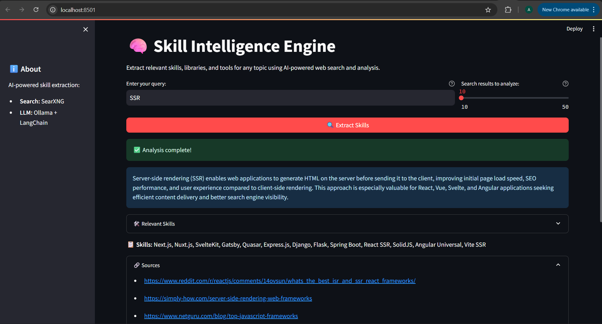
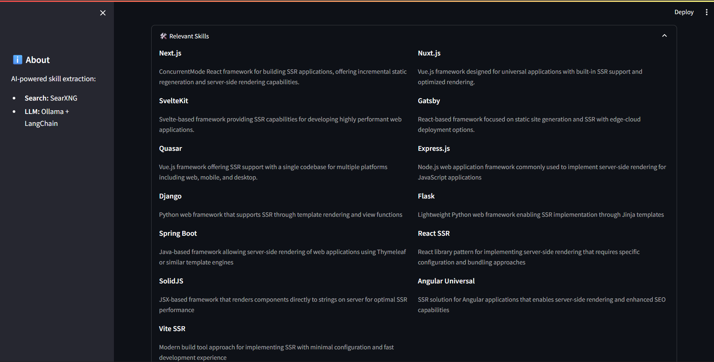
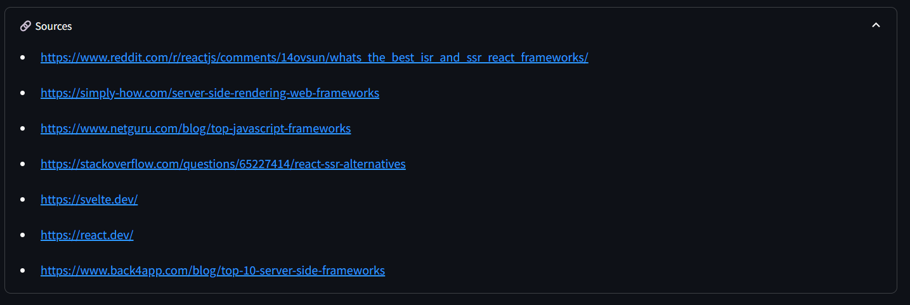

# 🧠 Skill Intelligence Engine

> AI-powered extraction of relevant skills, libraries, and tools from any topic — using SearXNG web search and Ollama LLM analysis.

---

## ⚡ Features

- **Web Search** — Queries SearXNG for real-time results on any topic
- **AI Analysis** — Feeds results to a local Ollama LLM for structured skill extraction
- **Clean Output** — Returns installable libraries/tools with descriptions, sources, and a flat skill list
- **Multiple Interfaces** — Choose between Streamlit UI or FastAPI REST endpoints
- **Environment-based config** — No hardcoded secrets; all credentials via `.env`

---

## 🗂️ Project Structure

```
Skill_Intelligence_Agent/
├── .env.example                # Template for .env
├── .gitignore
├── requirements.txt            # Python dependencies
├── skill-engine-agent.py       # Legacy CLI entry point
├── README.md
├── assets/
│   ├── UI.png                  # Main Streamlit UI
│   ├── relevant_skills_tab.png # Skills expanders
│   └── resources_tab.png       # Sources & API docs
└── app/
    ├── main.py                 # FastAPI app
    ├── streamlit_app.py        # Streamlit UI
    ├── endpoints/
    │   └── routes.py           # API route definitions
    └── services/
        └── engine.py           # Core logic (SearXNG + Ollama)
```

---
## 🛠️ Prerequisites & Documentation
Before running the application, ensure you have the following infrastructure set up:

- Python 3.8+ installed on your machine.

- Ollama running locally or remotely with your chosen model.

- SearXNG running as your search backend.

    - 📖 Docs: [SearXNG Docker Installation Guide](https://docs.searxng.org/admin/installation-docker.html)

## 🚀 Quick Start

### 1. Clone & Install

```bash
git clone <repo-url>
cd Skill_Intelligence_Agent

# Create & activate virtual environment
python -m venv search_agent_venv
search_agent_venv\Scripts\activate   # Windows
# source search_agent_venv/bin/activate  # Linux/macOS

# Install dependencies
pip install -r requirements.txt
```

### 2. Configure

Copy the example env file and fill in your credentials:

```bash
copy .env.example .env   # Windows
# cp .env.example .env  # Linux/macOS
```

Edit `.env`:

```env
SEARX_HOST=<URL>
OLLAMA_MODEL=nemotron-3-nano:30b-cloud
OLLAMA_BASE_URL=https://ollama.com
```

### 3. Run

#### FastAPI (recommended for production/integration)

```bash
uvicorn app.main:app --reload --host 0.0.0.0 --port 8000
```

Open [http://localhost:8000](http://localhost:8000)  
API docs available at [http://localhost:8000/docs](http://localhost:8000/docs)

#### Streamlit UI (recommended for exploration)

```bash
streamlit run app/streamlit_app.py
```

Open [http://localhost:8501](http://localhost:8501)

---

## 🖥️ Streamlit UI

### Main Interface

Enter a topic and click **Extract Skills**. The app returns:

- A 2–3 sentence AI summary of the topic
- Relevant skills (collapsible, two-column layout)
- A compact skill name list
- Source URLs (collapsible)



### Skills & Resources Tabs

Expand the **Relevant Skills** section to see libraries/tools with descriptions.  



Expand **Sources** to view all referenced URLs.



---

## 🔌 API Reference

### `POST /api/extract-skills`

Extract skills for a given query.

**Request:**

```json
{
  "query": "Python data science libraries",
  "num_results": 10
}
```

| Field | Type | Default | Description |
|---|---|---|---|
| `query` | string | — | **Required.** Topic to analyze |
| `num_results` | integer | 10 | Number of SearXNG results (5–50) |

**Response:**

```json
{
  "Python data science libraries": "Python is the leading language...",
  "Relevant Skills": {
    "NumPy": "Fundamental package for scientific computing...",
    "Pandas": "Data manipulation and analysis library...",
    "Matplotlib": "Comprehensive library for creating visualizations..."
  },
  "Sources": [
    "https://example.com/article",
    "https://example.com/guide"
  ],
  "Skill Names Only": [
    "NumPy", "Pandas", "Matplotlib", "SciPy", "Scikit-learn"
  ]
}
```

### `GET /api/health`

Health check endpoint.

```json
{ "status": "ok" }
```

---

## ⚙️ Configuration

All configuration is done via environment variables (set in `.env`):

| Variable | Description | Default |
|---|---|---|
| `SEARX_HOST` | SearXNG instance URL | `<self-hosted-url` |
| `OLLAMA_MODEL` | Ollama model name | `nemotron-3-nano:30b-cloud` |
| `OLLAMA_BASE_URL` | Ollama API base URL | `https://ollama.com` |
| `NUM_RESULTS_DEFAULT` | Default search result count | `10` |

---

## 🧪 How It Works

```
User Query
    │
    ▼
┌─────────────────┐     ┌──────────────────┐
│    SearXNG      │────▶│  Search Results  │
│  (web search)   │     │  (titles/snippets│
└─────────────────┘     └────────┬─────────┘
                                  │
                                  ▼
                       ┌──────────────────────┐
                       │   Ollama LLM         │
                       │  (nemotron-3-nano)   │
                       │  + LangChain prompt  │
                       └──────────┬───────────┘
                                  │
                                  ▼
                       ┌──────────────────────┐
                       │  Structured JSON     │
                       │  Skills + Sources    │
                       └──────────────────────┘
```

1. **Search** — Queries SearXNG for relevant web results
2. **Fallback** — If SearXNG is unavailable, falls back to LLM's training knowledge
3. **Analysis** — Feeds search results + query into an Ollama LLM via LangChain
4. **Parse** — Strips markdown fences and parses clean JSON response
5. **Return** — Returns structured result with skills, sources, and skill names

