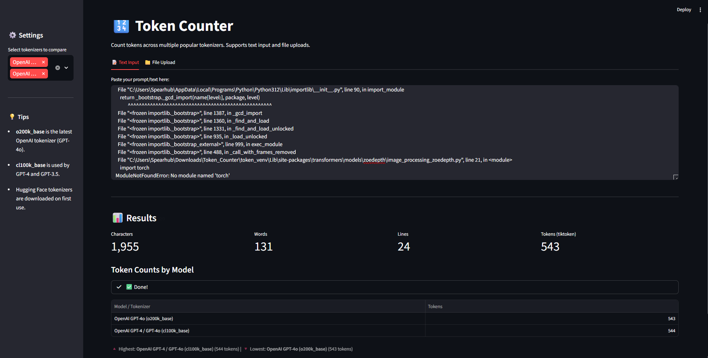

# 🔢 Token Counter

A simple yet powerful **Streamlit** app to count tokens across multiple popular AI model tokenizers. Supports both direct text input and file uploads.



---

## ✨ Features

- **📝 Text Input** — Paste your prompt or text directly into the app
- **📁 File Upload** — Upload `.txt`, `.md`, `.py`, `.json`, `.csv`, `.html`, `.xml`, `.yaml`, `.js`, `.ts`, `.css`, `.java`, `.c`, `.cpp`, `.cs`, `.go`, `.rs`, `.php`, `.swift`, `.kt`, `.r`, `.sql`, `.sh`, `.bat`, `.ps1`, `.ini`, `.cfg`, `.log`, and more
- **🔍 Multi-Tokenizer Support** — Compare token counts across OpenAI and Hugging Face models side-by-side
- **📊 Instant Metrics** — See character, word, line, and token counts at a glance
- **⚡ Cached Tokenizers** — Hugging Face tokenizers are downloaded once and cached for fast reuse

---

## 🚀 Getting Started

### 1. Clone or download the repository

```bash
cd Token_Counter
```

### 2. Create a virtual environment (recommended)

```bash
python -m venv token_venv
```

**Windows:**
```bash
token_venv\Scripts\activate
```

**macOS/Linux:**
```bash
source token_venv/bin/activate
```

### 3. Install dependencies

```bash
pip install -r requirements.txt
```

> **Note:** The `requirements.txt` uses the PyTorch CPU index for a lightweight install. If you need GPU support, remove the `--extra-index-url` line before installing.

### 4. Run the app

```bash
streamlit run main.py
```

The app will open automatically in your browser at `http://localhost:8501`.

---

## 🧠 Supported Tokenizers

| Model / Tokenizer | Backend |
|-------------------|---------|
| OpenAI GPT-4o (`o200k_base`) | `tiktoken` |
| OpenAI GPT-4 / GPT-3.5 (`cl100k_base`) | `tiktoken` |
| OpenAI GPT-3 (`p50k_base`) | `tiktoken` |
| OpenAI `r50k_base` | `tiktoken` |
| Hugging Face GPT-2 | `transformers` |
| Hugging Face Meta-Llama-3-8B | `transformers` |
| Hugging Face Mistral-7B | `transformers` |
| Hugging Face Google Gemma-2B | `transformers` |
| Hugging Face Microsoft Phi-3-mini | `transformers` |

Select which tokenizers to compare from the **⚙️ Settings** sidebar.

---

## 📁 Project Structure

```
Token_Counter/
├── main.py              # Streamlit application
├── requirements.txt     # Python dependencies
├── README.md            # This file
└── assets/
    └── UI.png           # App screenshot
```

---

## 🛠️ Built With

- [Streamlit](https://streamlit.io/) — UI framework
- [tiktoken](https://github.com/openai/tiktoken) — OpenAI tokenizers
- [Hugging Face Transformers](https://huggingface.co/docs/transformers/) — Open-source model tokenizers
- [PyTorch](https://pytorch.org/) — Backend for Transformers

---

