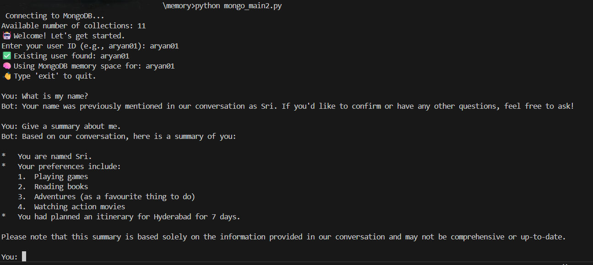

# Chatbot with MongoDB Memory

A conversational AI chatbot built with LangChain and MongoDB that maintains long-term memory of conversations.

## Features

- 🤖 Uses LangChain's ReAct agent for intelligent responses
- 💾 MongoDB-based persistent memory storage
- 👤 User session management and checkpointing
- 🔍 Memory search functionality
- 🧠 Long-term information storage

## Prerequisites

- Python 3.x
- MongoDB instance
- Ollama server running locally or remotely

## Required Dependencies

```bash
pip install langgraph langchain-ollama pymongo
```

## Configuration

Before running the bot, you need to set the following variables in `main.py`:

1. `MONGO_URI`: Your MongoDB connection string
2. `OLLAMA_URL`: The URL endpoint for your Ollama server
3. `DEFAULT_MODEL`: The LLM model to use (default is "llama3.1:8b")

## Usage

1. Run the script:
```bash
python main.py
```

2. Enter your user ID when prompted (e.g., "aryan01")

3. Start chatting with the bot! The bot can:
   - Save important information to memory
   - Search through past conversations
   - Maintain context across sessions

4. Type 'exit' or 'quit' to end the conversation

## Output



The image above demonstrates a sample conversation with the chatbot, showcasing:
- Identifies whether a user is new or returning based on their unique 'user_id'.
- Leverages memory retention and retrieval to provide accurate and context-aware responses.
- Maintains a natural, conversational flow with dynamic context tracking across interactions.
- Integrates MongoDB-backed persistent storage for scalable and reliable user data management.

## Architecture

The chatbot uses:
- LangGraph for the ReAct agent implementation
- MongoDB for storing:
  - User sessions and checkpoints
  - Long-term memory
- Ollama for the language model backend
- Custom tools for memory management

## Memory Management

The bot has two main memory-related tools:
1. `save_to_memory`: Saves important information from conversations
2. `search_memory`: Retrieves relevant information from past interactions
