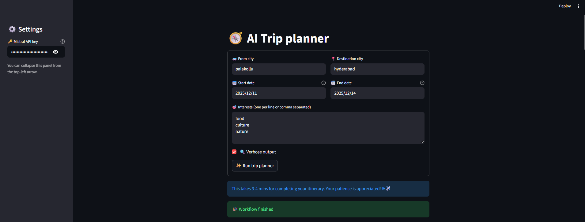

# AI Travel Guide

An intelligent travel planning application powered by CrewAI agents that helps you plan your trips with personalized itineraries based on your interests and preferences.

## Table of Contents
- [Overview](#overview)
- [Features](#features)
- [Architecture](#architecture)
- [Installation](#installation)
- [Usage](#usage)
- [Project Structure](#project-structure)
- [Demo](#demo)
- [Output Samples](#output)
- [Dependencies](#dependencies)
- [License](#license)

## Overview

The AI Travel Guide is a CrewAI-based application that leverages multiple AI agents to create personalized travel itineraries. It takes into account your travel dates, destination, and interests to generate a comprehensive travel plan.

## Features

- **Intelligent Trip Planning**: Automatically generates a complete travel itinerary based on your preferences
- **Multi-Agent System**: Uses specialized agents for different aspects of travel planning:
  - Location Agent: Gathers information about destinations
  - Guide Agent: Provides recommendations based on interests
  - Planner Agent: Creates a cohesive travel plan
- **Personalized Recommendations**: Tailors suggestions to your specific interests (food, culture, nature, etc.)
- **Web Search Integration**: Uses web search tools to gather up-to-date information

## Architecture

The application uses a multi-agent system built with CrewAI:

1. **Location Agent**: Researches destination information
2. **Guide Agent**: Provides activity and attraction recommendations
3. **Planner Agent**: Synthesizes all information into a cohesive itinerary

## Installation

1. Clone the repository:
   ```bash
   git clone <repository-url>
   cd 5.AI_Travel_Guide
   ```

2. Create a virtual environment:
   ```bash
   python -m venv venv
   source venv/bin/activate  # On Windows: venv\Scripts\activate
   ```

3. Install dependencies:
   ```bash
   pip install -r requirements.txt
   ```

4. Set up your API key:
   - Create a `.env` file in the project root
   - Add your API key: `MISTRAL_API_KEY=your_api_key_here`
   - Or enter it directly in the Streamlit app interface

## Usage

1. Set up your Mistral API key:
   - Create a `.env` file in the project root
   - Add your API key: `MISTRAL_API_KEY=your_api_key_here`
   - Or enter it directly in the Streamlit app interface

2. Run the Streamlit application:
   ```bash
   streamlit run app.py
   ```

3. Enter your travel details in the web interface:
   - Departure city
   - Destination city
   - Travel dates
   - Your interests (food, culture, nature, etc.)

4. View the generated travel plan in the output folder.

## Project Structure

```
5.AI_Travel_Guide/
├── agents.py          # Defines the AI agents
├── app.py             # Streamlit web application interface
├── tasks.py           # Defines agent tasks
├── tools.py           # Custom tools for agents
├── requirements.txt   # Project dependencies
├── .gitignore         # Git ignore file
├── README.md          # This file
├── assets/            # Demo images and assets
│   └── demo.png       # Application demo screenshot
└── output/            # Generated travel plans
    ├── trip_plan.md   # Sample travel plan
    └── trip_plan-2.md # Additional travel plan
```

## Demo


## Output
- Check the `output` folder for generated travel plans.

## Dependencies

- [CrewAI](https://github.com/crewAIInc/crewAI) - Framework for orchestrating role-playing AI agents
- LiteLLM - Library for calling LLMs
- DDGS - DuckDuckGo search tool

## License

This project is licensed under the MIT License - see the LICENSE file for details.