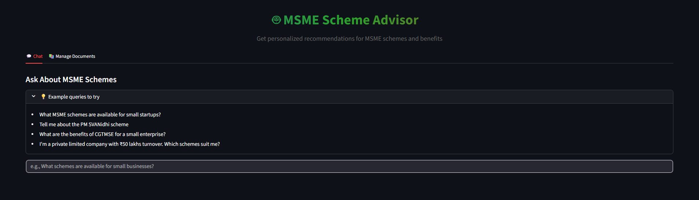
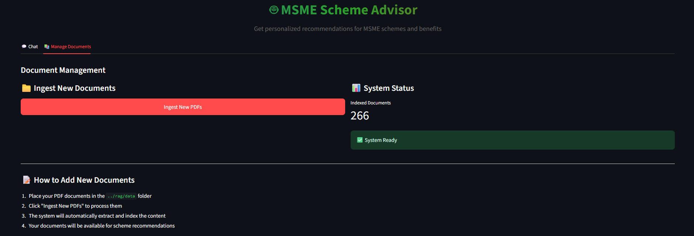
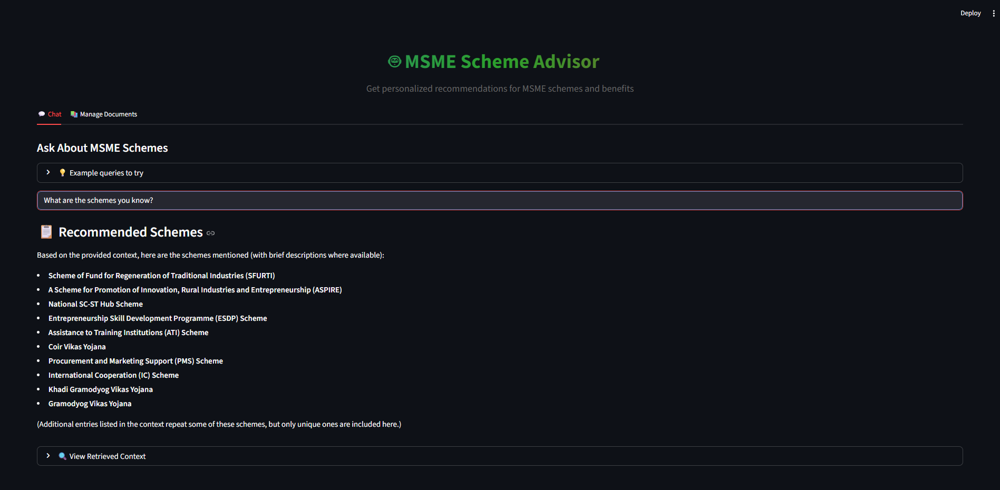

# 🤖 MSME Scheme Advisor

An intelligent chatbot application that helps MSMEs (Micro, Small, and Medium Enterprises), NGOs, and startups discover and understand government and institutional schemes relevant to their business needs.



## 📋 Table of Contents
- [Overview](#overview)
- [Features](#features)
- [Dependencies](#dependencies)
- [Configuration](#configuration)
- [Usage](#usage)
- [Screenshots](#screenshots)
- [Project Structure](#project-structure)
- [Technologies Used](#technologies-used)
- [Contributing](#contributing)
- [License](#license)

## 📖 Overview

The MSME Scheme Advisor is a Retrieval-Augmented Generation (RAG) application that leverages large language models and vector databases to provide accurate, context-aware recommendations for MSME schemes. It processes PDF documents containing scheme information and allows users to query this information through a natural language interface.

## ✨ Features

- **Intelligent Chat Interface**: Natural language querying of MSME schemes
- **PDF Document Processing**: Automatic ingestion and indexing of scheme documents
- **Hybrid Search**: Combines vector similarity search with full-text search for better results
- **Contextual Re-ranking**: Uses BGE reranker to improve result relevance
- **Scheme Analysis**: Extracts and presents scheme details, benefits, and eligibility criteria
- **Profile Matching**: Analyzes user profiles against scheme eligibility requirements
- **Modern UI**: Clean, responsive interface with tabbed navigation


## 🚀 Dependencies

1. Install required dependencies:
   ```bash
   pip install -r requirements.txt
   ```

2. Ensure you have the required Ollama models:
   ```bash
   ollama pull granite4:tiny-h
   ollama pull snowflake-arctic-embed2:latest
   ```

## ⚙️ Configuration

Before running the application, you need to configure the following in `streamlit_rag_bot.py`:

1. **MongoDB Connection**:
   ```python
   MONGO_URI = "mongodb+srv://<username>:<password>@cluster0.mongodb.net/?retryWrites=true&w=majority"
   ```

2. **Ollama Endpoint**:
   ```python
   OLLAMA_URL = "https://ollama.com"
   ```

3. **Place your PDF documents** in the `data/` folder for processing.

## 🎯 Usage

1. Start the Streamlit application:
   ```python
   streamlit run streamlit_rag_bot.py
   ```

2. **Chat Tab**:
   - Enter your query about MSME schemes
   - Get personalized recommendations based on scheme documents
   - View retrieved context for transparency

3. **Document Management Tab**:
   - Ingest new PDF documents
   - View system status and indexed document count

## 📸 Screenshots

### Chat Interface

*Ask questions about MSME schemes and get intelligent recommendations*

### Document Management

*Manage and ingest PDF documents containing scheme information*

### Example Output

*List of available schemes with concise summaries*


*Response for queries about non-existent schemes*


*Scheme information*

## 📁 Project Structure

```
msme-scheme-advisor/
├── streamlit_rag_bot.py    # Main application file
├── requirements.txt        # Python dependencies
├── assets/                 # Images and media files
│   ├── interface_tab-1.png
│   ├── interface_tab-2.png
│   ├── output-1.png
│   ├── output-2.png
│   └── output-3.png
├── data/                   # PDF documents for scheme information
└── README.md               # This file
```

## 🛠️ Technologies Used

- **Streamlit**: Web application framework
- **Langchain**: LLM orchestration framework
- **MongoDB Atlas**: Vector database and document storage
- **Ollama**: Local LLM inference engine
- **PyMuPDF**: PDF processing
- **HuggingFace Transformers**: Reranking model (BGE)
- **Sentence Transformers**: Embedding generation

## 📧 Contact

For questions or support, please open an issue in the repository.

> ⚠️ **Educational Purposes Only**: This application is designed for educational and demonstration purposes only. It should not be used for making actual business decisions regarding MSME schemes.